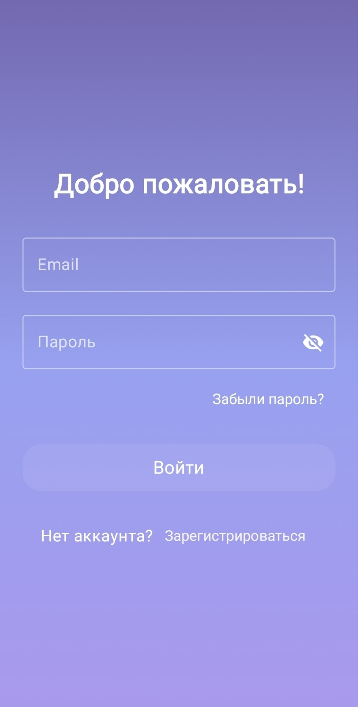
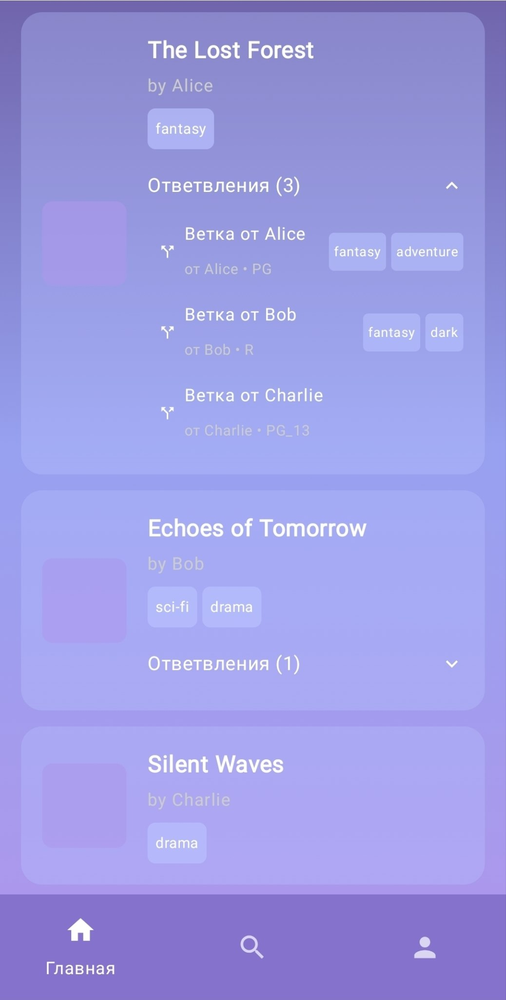
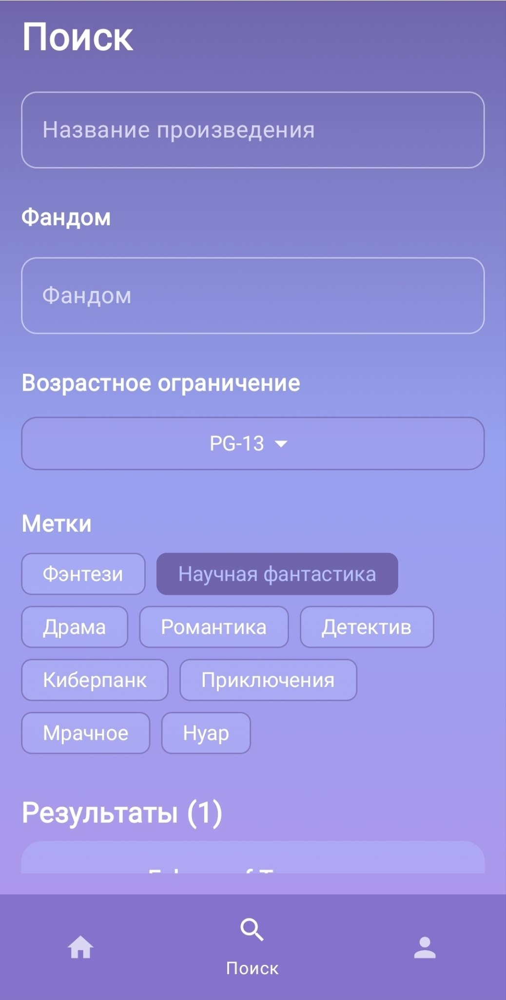
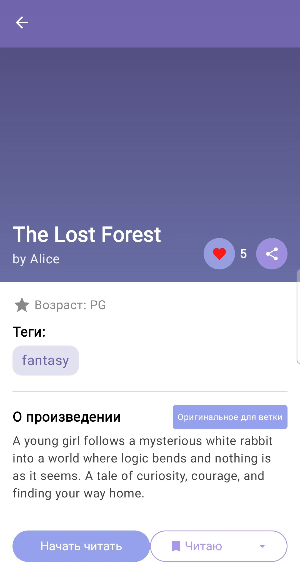
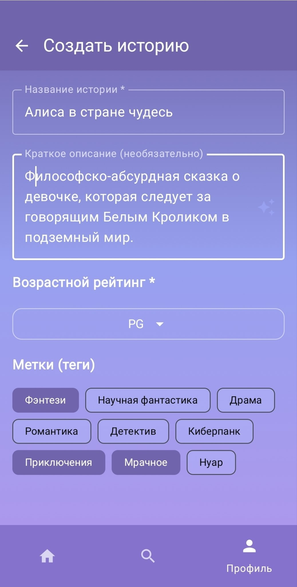
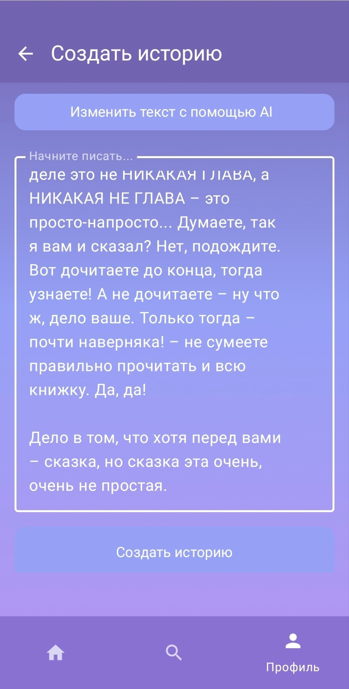
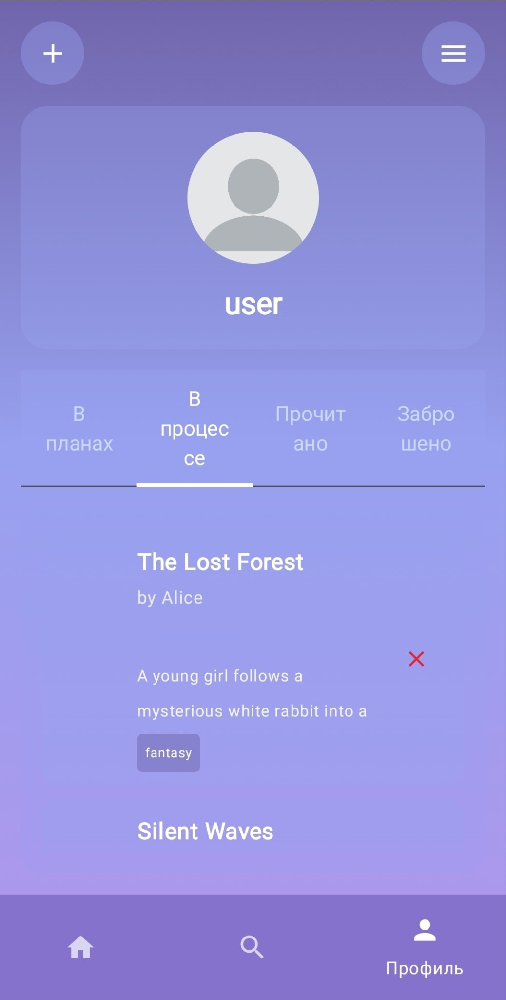
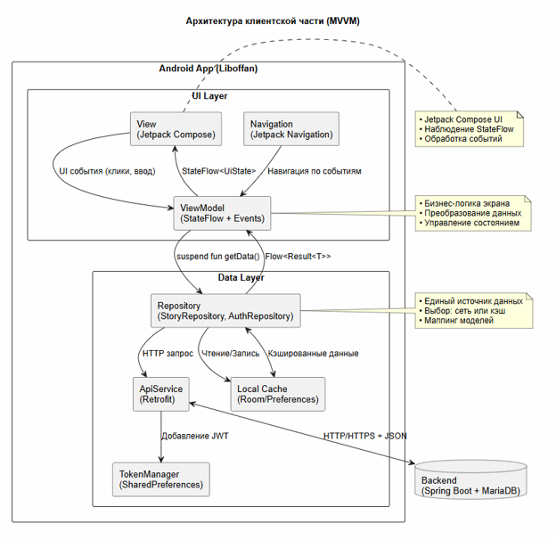
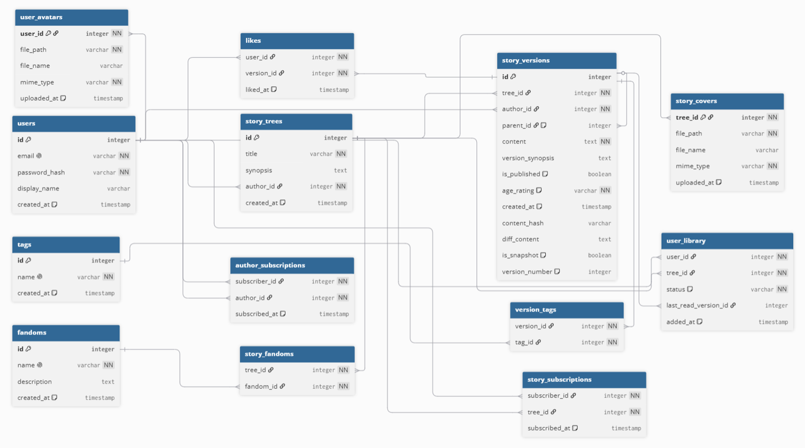
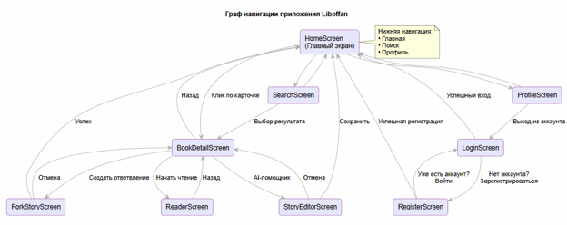

# Liboffan — Платформа коллаборативного создания историй с ветвлением сюжетов

**Курсовая работа** · ФГБОУ ВО «Воронежский государственный университет», факультет компьютерных наук  
**Направление** 09.03.02 «Информационные системы и технологии», 6 семестр  
**Автор:** Щеблыкина А.В.
**Руководитель:** Ушаков В.А.

---

## Описание проекта

Мобильное приложение для чтения и совместного создания историй с поддержкой нелинейного повествования. Liboffan позволяет авторам создавать альтернативные версии сюжетов, а читателям — выбирать предпочтительное развитие событий, не теряя связи с оригинальным произведением.

**Ключевые возможности:**
- **Ветвление историй** — создание ответвлений от существующих произведений
- **Коллаборативное творчество** — прозрачная система авторства версий
- **AI-помощник** — редактирование текста с использованием локальной модели Ollama
- **Персональная библиотека** — отслеживание статуса чтения (planned, reading, completed, dropped)
- **Теги и фандомы** — удобная категоризация и поиск контента
- **Возрастные рейтинги** — G, PG, PG-13, R, NC-17

## Архитектура и технологии

| Компонент | Технология | Назначение |
|-----------|------------|------------|
| **Mobile App** | Kotlin + Jetpack Compose | Клиентское Android-приложение |
| **Backend** | Spring Boot 3 + Java | REST API, бизнес-логика |
| **Database** | MariaDB | Хранение данных (пользователи, истории, версии) |
| **AI** | Ollama (локально) | Редактирование и генерация текста |
| **Auth** | JWT + Spring Security | Аутентификация и авторизация |
| **Network** | Retrofit + OkHttp | HTTP-запросы, кэширование токенов |

## Структура базы данных

Основные сущности:
- **users** — пользователи (email, password_hash, display_name)
- **story_trees** — деревья историй (title, synopsis, author_id)
- **story_versions** — версии историй (tree_id, author_id, parent_id, content, age_rating)
- **user_library** — библиотека пользователя (user_id, tree_id, status, last_read_version_id)
- **tags / version_tags** — теги и связи с версиями
- **fandoms / story_fandoms** — фандомы и связи
- **likes** — лайки версий
- **author_subscriptions / story_subscriptions** — подписки

Вот обновлённые разделы для вашего README.md:

---

## Репозитории проекта

**Frontend (Android приложение):**  
[github.com/ваш-username/liboffan-mobile](https://github.com/Kot-v-meshke/Liboffan)

**Backend (Spring Boot API):**  
[github.com/ваш-username/liboffan-backend](https://github.com/Kot-v-meshke/LiboffanFull)

---


##  Экраны приложения

| Экран | Описание |
|-------|----------|
| **LoginScreen** | Авторизация с JWT-токеном |
| **HomeScreen** | Каталог историй с отображением ответвлений |
| **SearchScreen** | Поиск по названию, тегам, фандомам, рейтингу |
| **BookDetailScreen** | Детали истории, список веток |
| **ReaderScreen** | Чтение текста с настройками отображения |
| **StoryEditorScreen** | Создание истории / ответвления |
| **AIEditScreen** | AI-редактирование текста (сокращение, улучшение стиля) |
| **ProfileScreen** | Профиль, библиотека, настройки |

## Скриншоты приложения

<table>
  <tr>
    <td align="center"><b>Авторизация</b><br><br><i>Экран входа с JWT-аутентификацией</i></td>
    <td align="center"><b>Главный экран</b><br><br><i>Каталог историй с ответвлениями</i></td>
    <td align="center"><b>Поиск</b><br><br><i>Фильтрация по тегам и фандомам</i></td>
  </tr>
  <tr>
    <td align="center"><b>Информация о книге</b><br><br><i>Синопсис, рейтинг и теги</i></td>
    <td align="center"><b>Создание истории</b><br><br><i>Форма создания новой истории</i></td>
    <td align="center"><b>AI-редактор</b><br><br><i>Редактирование с Ollama</i></td>
  </tr>
  <tr>
    <td align="center" colspan="3"><b>Профиль и библиотека</b><br><br><i>Персональная библиотека с вкладками статусов</i></td>
  </tr>
</table>

## Быстрый старт

### Требования
- **Backend:** Java 17+, Maven, MariaDB 10.6+
- **Mobile:** Android Studio Arctic Fox+, Android SDK 26+
- **AI:** Ollama (опционально, для AI-редактирования)

### Запуск сервера

```bash
# 1. Настройка базы данных
mysql -u root -p < database/schema.sql
mysql -u root -p < database/seed_data.sql

# 2. Конфигурация приложения
cd backend
cp application.properties.example application.properties
# Отредактируйте параметры БД и JWT

# 3. Запуск
mvn spring-boot:run
```

### Запуск Android-приложения

```bash
cd mobile-app
# Откройте проект в Android Studio
# Или через командную строку:
./gradlew assembleDebug
```

### Настройка Ollama (опционально)

```bash
# Установите Ollama: https://ollama.com
ollama pull llama3.2:3b

# Проверка
curl http://localhost:11434/api/tags
```

## Структура проекта

```
Liboffan/
├── backend/                    # Spring Boot сервер
│   ├── src/main/java/
│   │   └── com.example.demo/
│   │       ├── config/         # Конфигурация безопасности, CORS
│   │       ├── controller/     # REST контроллеры
│   │       ├── dto/            # Data Transfer Objects
│   │       │   ├── request/
│   │       │   └── response/
│   │       ├── model/          # JPA сущности
│   │       ├── repository/     # Spring Data репозитории
│   │       ├── service/        # Бизнес-логика
│   │       └── util/           # Утилиты (JWT, BCrypt)
│   ├── src/main/resources/
│   │   ├── application.properties
│   │   └── data.sql
│   └── pom.xml
│
├── mobile-app/                 # Android приложение
│   ├── app/src/main/
│   │   ├── java/com.example.liboffan/
│   │   │   ├── components/     # UI компоненты Compose
│   │   │   ├── model/          # Data classes
│   │   │   │   ├── dto/
│   │   │   │   ├── request/
│   │   │   │   └── response/
│   │   │   ├── network/        # Retrofit API, TokenManager
│   │   │   └── screens/        # Экраны приложения
│   │   │       ├── Auth/
│   │   │       ├── book/
│   │   │       ├── home/
│   │   │       ├── profile/
│   │   │       └── search/
│   │   └── res/
│   └── build.gradle.kts
│
├── database/
│   ├── schema.sql              # DDL скрипты
│   └── seed_data.sql           # Тестовые данные
│
└── documents/                  # Курсовая работа
    ├── курсовая.pdf
    ├── презентация.pptx
    └── диаграммы/
```

## Безопасность

- Пароли хранятся в хэшированном виде (BCrypt)
- JWT-токены с ограниченным временем жизни
- HTTPS для всех сетевых запросов
- Валидация входных данных на сервере
- SQL-инъекции предотвращены через JPA/Hibernate

## Диаграммы

### Архитектура системы


### ER-диаграмма базы данных


### Граф навигации приложения


## Результаты работы

**Исследовано:**
- Рынок платформ для чтения и пользовательского творчества
- Существующие решения (Wattpad, Author.Today, Ficbook) и их ограничения
- Возможности интеграции AI для редактирования текста

**Разработано:**
- Полнофункциональное Android-приложение с современным UI (Jetpack Compose)
- REST API с поддержкой версионирования историй
- Система ветвления с прозрачным отслеживанием авторства
- Интеграция локального AI-помощника (Ollama)
- Персональная библиотека с гибкой системой статусов

**Внедрено:**
- MVVM архитектура с разделением ответственности
- StateFlow для реактивного обновления UI
- Retrofit + OkHttp для сетевого взаимодействия
- JWT-аутентификация с безопасным хранением токенов

## Документация

| Тип | Файл |
|-----|------|
| **Курсовая pdf** | [документы/курсовая.pdf](documents/курсовая.pdf) |
| **Курсовая word** | [документы/курсовая.pdf](documents/курсовая.pdf) |
| **Презентация powerpoint** | [документы/Презентация.pptx](documents/Презентация.pptx) |
| **Презентация pdf** | [документы/Презентация.pdf](documents/Презентация.pdf) |
| **Демонстрация** | [документы/Видео.mp4](documents/Видео.mp4) |

## Тестирование

### Основные сценарии
1. **Регистрация и авторизация** → получение JWT, сохранение в TokenManager
2. **Создание истории** → POST /api/stories, публикация в каталоге
3. **Создание ответвления** → POST /api/stories/{treeId}/fork, связь с parent_id
4. **Добавление в библиотеку** → POST /api/me/library с статусом
5. **AI-редактирование** → POST /api/ai/edit, предпросмотр изменений

### API Endpoints

| Метод | Endpoint | Описание |
|-------|----------|----------|
| POST | `/api/auth/register` | Регистрация пользователя |
| POST | `/api/auth/login` | Вход, получение JWT |
| GET | `/api/stories` | Список историй |
| POST | `/api/stories` | Создание истории |
| POST | `/api/stories/{treeId}/fork` | Создание ответвления |
| GET | `/api/stories/versions/{id}` | Получение версии |
| POST | `/api/me/library` | Добавить в библиотеку |
| GET | `/api/me/library` | Моя библиотека |
| POST | `/api/ai/edit` | AI-редактирование текста |
| GET | `/api/tags` | Список тегов |
| GET | `/api/fandoms` | Список фандомов |


## Автор

**Разработчик:**  Щеблыкина Арина Вадимовна 
**Email:** [arina.cheblikiba@gmail.com]  
**GitHub:** [@Kot-v-meshke](https://github.com/Kot-v-meshke)
